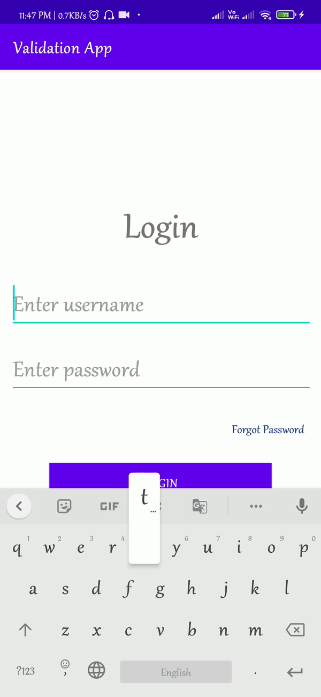
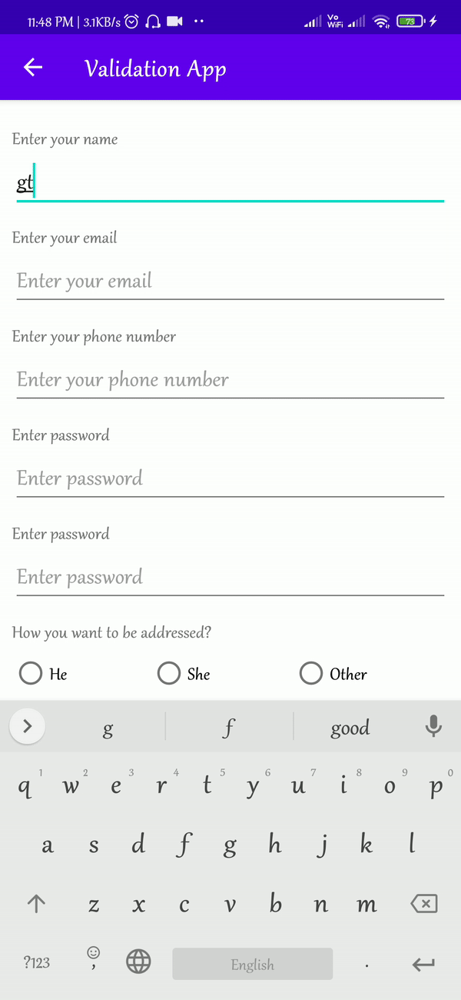

# Kotlin Validations
<html>
<head>

</head>
<body>

This application demonstrates the validations that can be applied in an app.
Views used
1. Edittext
2. TextView
3. Button
4. RadioGroup
5. RadioButton

To show errors, setError method is used and to show alerts to the user, Toast is used

  

  

  

  

</body>
</html>

 
